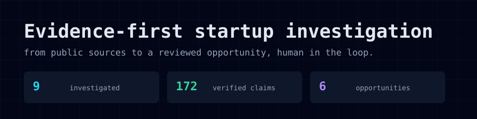
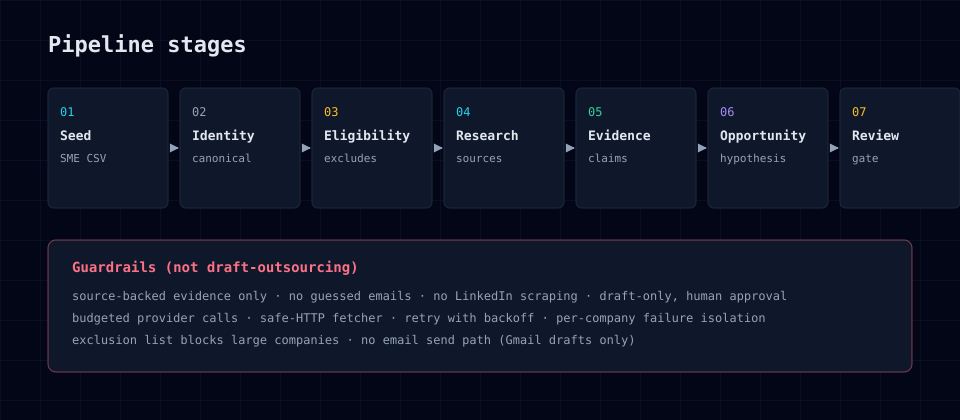
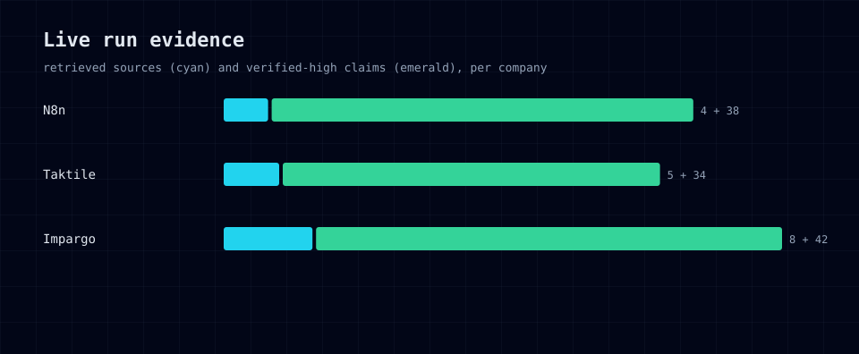

# Startup Automation Scout

[](https://github.com/derinbarutcu17/startup-automation-scout/actions/workflows/ci.yml)
[](LICENSE)
[](#)
[](#)
[](#)



Evidence-first investigation workbench: turn a public company URL into a
reviewed automation opportunity — with claims that trace back to real sources,
a quality gate that rejects generic ideas, and a human making the final call.

Not a lead generator. Not a cold-email bot. It answers one question well:

> Which startup is worth investigating for an automation project, what workflow
> is plausibly painful, what evidence supports that hypothesis, and what small
> system could be built to help?

## What it does

Given a seed set of companies (URLs or a Berlin SME CSV), the Scout:

1. **Investigates** — resolves the company, checks eligibility
2. **Researches** — fetches first-party public sources only
3. **Extracts evidence** — claims are Verified, Inferred, Estimated, or Unknown
4. **Generates opportunities** — workflow hypothesis → automation proposal
5. **Reviews** — deterministic quality gate + rubric scorecard
6. **Hands off** — outreach preparation bundle, human approval before anything sends



## Live run evidence



Numbers are generated from the local run database and are regenerable:

```bash
pnpm exec tsx scripts/gen-proof-data.ts   # reads the DB → docs/evidence.json
pnpm exec tsx scripts/gen-proof-charts.ts # evidence.json → assets/*.svg
```

## Why it's not another lead generator

- **Evidence, not vibes**: every claim links to a retrieved source document.
  No guessed emails, no LinkedIn scraping, no unverifiable claims.
- **Gates, not promises**: the quality gate rejects generic proposals,
  unsupported savings, and private-access-only ideas. Scores are deterministic
  weighted rubrics with stored rationales.
- **Human in the loop**: outreach stays draft-only; the Telegram delivery action
  is explicit and idempotent; Gmail drafts require an approval step. There is
  no email send, inbox, scheduling, or CRM path.
- **Bounded and honest**: budgeted provider calls, per-company failure
  isolation, retry with exponential backoff, and an "unknowns" section in
  every dossier. The README tells you what it does NOT claim.

## Quickstart

Requirements: Node 22, pnpm 11.10, PostgreSQL 17.

```bash
pnpm install
cp .env.example .env
docker compose up -d postgres
pnpm db:migrate
pnpm dev          # dashboard at http://127.0.0.1:3000
```

Run the worker in a second terminal:

```bash
pnpm worker
```

### Berlin SME run (Product Hunt seeds)

The live Berlin workflow accepts a user-supplied CSV of permitted Product Hunt
launch data. The app does not call the Product Hunt API — the source boundary
stays explicit:

```bash
cp data/product-hunt-berlin.example.csv data/product-hunt-berlin.csv
# fill with Berlin startups: product_name, company_domain, location,
# employee_count, company_size, product_hunt_url, tagline, launch_date

pnpm scout:product-hunt -- data/product-hunt-berlin.csv
pnpm worker
```

The run defaults to Berlin, excludes configured large companies, and requires
size evidence for the seed workflow.

### Guardrails

- **Safe-HTTP retrieval**: rejects loopback, private, and unsafe addresses
- **Source tiers**: search is discovery only; original retrieved sources back
  verified claims
- **Context injection safety**: source text is treated as untrusted data, never
  instructions
- **Retry with backoff**: capped exponential backoff, at least 5 attempts
  before a work item goes terminal

## Architecture

- `app/` — Next.js App Router pages (runs, companies, opportunities, prospects)
- `src/application/` — run lifecycle, orchestration, server actions
- `src/domain/` — configuration, eligibility, quality gates, scoring, types
- `src/infrastructure/db/` — Drizzle schema, migrations, repositories
- `src/infrastructure/queue/` — Postgres-backed leasing queue
- `src/providers/` — search + model providers (fixture, live, fallback)
- `src/worker/` — independently runnable worker and weekly scheduler
- `src/modules/` — person research, outreach analysis, draft composer,
  Hermes export, prospect PDF, Telegram delivery
- `tests/` — unit, integration, provider-contract, security, Playwright e2e

The pipeline:

```text
company URL
  → ScoutRun → Postgres work queue → identity → eligibility → public-source research
  → evidence → workflow hypothesis → automation opportunity → quality gate → score
```

## Docs

- `docs/ARCHITECTURE.md` — system design
- `docs/DATA_MODEL.md` — schema
- `docs/EVIDENCE_POLICY.md` — claim tiers, source rules
- `docs/SCORING.md` — rubric dimensions
- `docs/FAILURE_MODES.md` — what can go wrong and how it's handled
- `docs/PRIVACY_LEGAL_PLATFORM.md` — outreach boundaries

## What it does NOT claim

- No 20-company human-reviewed golden benchmark yet (the fixture evaluation is
  a deterministic regression harness, not that benchmark)
- Not production-ready: no auth, no multi-user permissions
- Public SearXNG instances are convenience fallbacks, not a reliability or
  confidentiality guarantee
- Suggestions in prospect dossiers are starting points for human review, not
  claims about a company's internal needs

## License

MIT — see [LICENSE](LICENSE).

## Contact

Questions, ideas, pull requests: [GitHub](https://github.com/derinbarutcu17).
